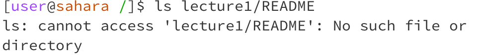
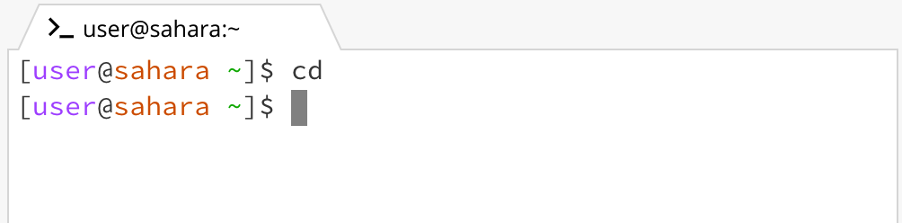
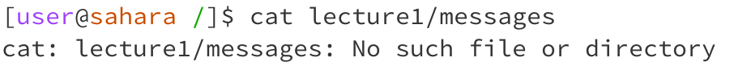
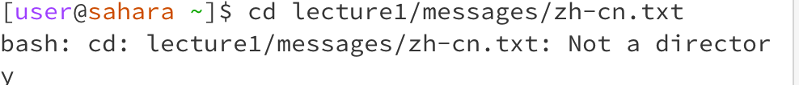
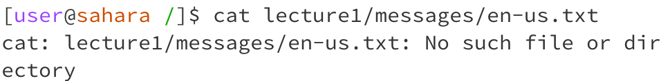
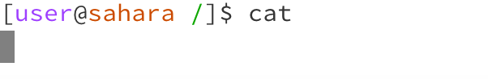
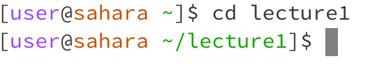
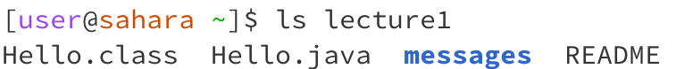
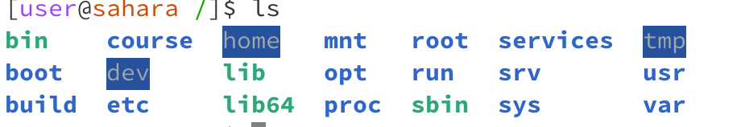

## Lab Report 1 - Remote Access and FileSystem (Week 1)

When I ran "cat" with no arguments, I got an empty output. THe working directory was the root directory. I got this output because I had no arguments, and "cat" requires at least one text file to print something. So, it's not an error.

When I ran "cd" with no arguments, I got an empty output. The working diectory was the root directory. I got this output because I had no arguments, and "cd" requires at least one directory to do anything. So, it's not an error but rather the expected output.

When I ran cat with the `lecture1/messages` directory, I got an error saying No such file or directory. This is expected because cat writes the contents of a file to the terminal, but a directory has no readable content because it's not a file.

When I ran `cd lecture1/messages/zh-ch.txt`, I got an error saying that it was not a directory. This output is expected because you can only change directories to another directory/folder. Here, we tried to do it to a file, which is invalid.

When I ran `cat lecture1/messages/en-us.txt`, I got an error saying No such file or directory. This is expected because you can only have file arguments for the cat command. But here, we have a directory as the argument, which is invalid. So you must already be in the directory of the file you want to use "cat" with.

When I ran `cd lecture1`, the terminal showed that the directory changed to lecture1, and was operating in that directory. This is the expected output, as we changed directories to another directory/folder, so it is a valid input.

When I ran `ls lecture1/README`, I got an error saying No such file or directory. This is the expected output because you ls lists the files in a directory. Here, we have a path to a file, and there cannot be files within a file. Thus, it is an invalid input. 

When I ran `ls lecture1`, I got an output of Hello.class, Hello.java, messages folder, and README. This is expected because ls prints the content in the specified directory, and we were in the lecture1 directory, so it printed all of the content of lecture1 and is a valid input.

When I ran ls in the home directory, it showed all of the core directories such as bin, home, root, usr, var, build, etc. This is expected because we were in the root directory, and these all are the content of the root directory, thus it is a valid input. 

