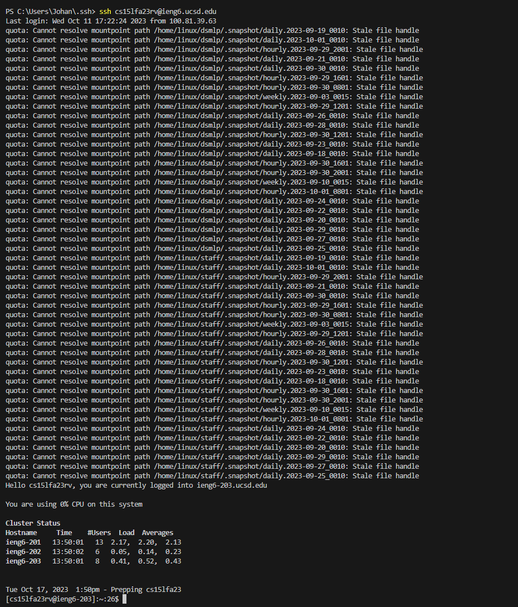

## Lab Report 2 - Servers and SSH Keys (Week 3)
**Code for StringServer**


*/add-message1*


*/add-message2*


1.) handle(HttpExchange exchange): This method is part of the MessageHandler class, which implements the HttpHandler interface. The HttpExchange object, exchange, encapsulates an HTTP request received and a response to be generated in one exchange. It provides methods for examining the request from the client, and for building and sending the response.

2.) The relevant arguments and fields for this method are:

HttpExchange exchange: This argument contains the request from the client. The method uses it to get the request method (exchange.getRequestMethod()) and the query string (exchange.getRequestURI().getQuery()).
counter: This is a static field of type AtomicInteger in the StringServer class. It keeps track of the message number. The method uses it to get the next number in sequence (counter.getAndIncrement()).
messages: This is a static field of type StringBuilder in the StringServer class. It stores the running string. The method appends the new message to this string (messages.append(...)).

3.) The values of these fields change as follows:

counter: Each time a request is received, the handle() method increments this field by 1 using the getAndIncrement() method.
messages: Each time a request is received, the handle() method appends a new line, the current value of counter, and the new message to this field.

So, for example, if you send a request to /add-message?s=Hello, then:

The handle() method is called with an HttpExchange object that represents your request.
The method increments counter from 0 to 1.
The method appends “\n1. Hello” to messages.
The server responds with “1. Hello”.
If you then send another request to /add-message?s=How are you, then:

The handle() method is called again with a new HttpExchange object.
The method increments counter from 1 to 2.
The method appends “\n2. How are you” to messages.
The server responds with “1. Hello\n2. How are you”.

*Path to public and private keys*


The full path to the public and private keys is ```C:\Users\Johan\.ssh```


The full path on ieng6 to the public key is ```/home/linux/ieng6/cs15lfa23/cs15lfa23rc/.ssh```. Within this path is the ```authorized_keys``` file. This file contains my public key, and if I run ```cat authorized_keys``` within this directory, then the contents of my public key are returned.

*Logging into ieng6 without being asked for a password*




Something I learned from lab in week 2 and 3 is that you can remotely connect to a computer with an "ssh" command. This is something entirely new to me and I previously had no idea that something like this was possible. I also learned that you can set up remote, local servers on your own computer, and that's something that I find fascinating. Also, that you can edit these servers from the search bar and add stuff/remove stuff from the server by using commands you set up. 
