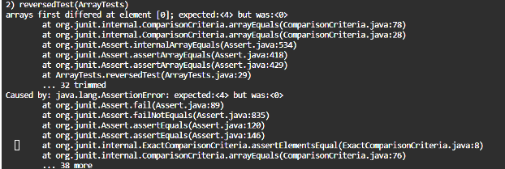
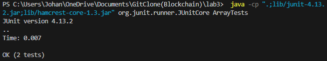

## Lab Report 3 - Bugs and Commands (Week 5)

Failure inducing input:
```
@Test
public void reversedTest() {
    int[] input1 = {1, 2, 3, 4, 5};
    assertArrayEquals(new int[]{5, 4, 3, 2, 1}, ArrayExamples.reversed(input1));
}
```
Associated code:
```
static int[] reversed(int[] arr) {
    int[] newArray = new int[arr.length];
    for(int i = 0; i < arr.length; i += 1) {
      arr[i] = newArray[arr.length - i - 1];
    }
    return arr;
  }
```

Symptom:



Input without failure:
```
@Test
  public void reversedTest() {
    int[] input1 = { 7, 6, 5, 3};
    assertArrayEquals(new int[3, 5, 6, 7]{ }, ArrayExamples.reversed(input1));
  }
}
```

Associated code:
```
static int[] reversed(int[] arr) {
    int[] newArray = new int[arr.length];
    for(int i = 0; i < arr.length; i += 1) {
      newArray[arr.length - i - 1] = arr[i];
    }
    return newArray;
  }
```
Bug:

```arr[i] = newArray[arr.length - i - 1];```

Fixed bug:

```newArray[arr.length - i - 1] = arr[i];```

This switches the position of those two statements and assigns the value in the array that's been reversed to the current position in the array, generating a new, reversed array given the current inputs.

Test without any symptoms:




## Interesting find commands
*```find / -name "*.txt" 2>/dev/null``` command* 

In the ```c/Users/Johan/OneDrive/Documents/GitClone/docsearch/technical``` directory:
```
/wp-exploitable-themes.txt
/mnt/e/$RECYCLE.BIN/S-1-5-21-3021986586-1156689342-2357939180-1002/$R1733Q0/embedded/framework/data/wordlists/wp-plugins.txt
/mnt/e/$RECYCLE.BIN/S-1-5-21-3021986586-1156689342-2357939180-1002/$R1733Q0/embedded/framework/data/wordlists/wp-themes.txt
/mnt/e/$RECYCLE.BIN/S-1-5-21-3021986586-1156689342-2357939180-1002/$R1733Q0/embedded/framework/docs/robots.txt
/mnt/e/$RECYCLE.BIN/S-1-5-21-3021986586-1156689342-2357939180-1002/$R1733Q0/embedded/framework/external/burp-proxy/readme.txt
/mnt/e/$RECYCLE.BIN/S-1-5-21-3021986586-1156689342-2357939180-1002/$R1733Q0/embedded/framework/external/source/cmdstager/debug_asm/woop.txt
/mnt/e/$RECYCLE.BIN/S-1-5-21-3021986586-1156689342-2357939180-1002/$R1733Q0/embedded/framework/external/source/DLLHijackAuditKit/README.txt
/mnt/e/$RECYCLE.BIN/S-1-5-21-3021986586-1156689342-2357939180-1002/$R1733Q0/embedded/framework/external/source/exploits/CVE-2010-3563/build.txt
/mnt/e/$RECYCLE.BIN/S-1-5-21-3021986586-1156689342-2357939180-1002/$R1733Q0/embedded/framework/external/source/exploits/cve-2015-0016/LICENSE.txt
/mnt/e/$RECYCLE.BIN/S-1-5-21-3021986586-1156689342-2357939180-1002/$R1733Q0/embedded/framework/external/source/exploits/CVE-2015-2426/LICENSE.txt
^C
```
In the ```c/Users/Johan/OneDrive/Documents/GitClone/docsearch/technical/government``` dierctory:
```e/pxesploit/regeditor/README.txt
/mnt/e/$RECYCLE.BIN/S-1-5-21-3021986586-1156689342-2357939180-1002/$R1733Q0/embedded/framework/external/source/shellcode/windows/speech/COPYRIGHT.txt
/mnt/e/$RECYCLE.BIN/S-1-5-21-3021986586-1156689342-2357939180-1002/$R1733Q0/embedded/framework/external/source/vncdll/vncdll/LICENSE.txt
/mnt/e/$RECYCLE.BIN/S-1-5-21-3021986586-1156689342-2357939180-1002/$R1733Q0/embedded/framework/external/source/vncdll/winvnc/COPYING.txt
/mnt/e/$RECYCLE.BIN/S-1-5-21-3021986586-1156689342-2357939180-1002/$R1733Q0/embedded/framework/external/source/vncdll/winvnc/LICENCE.txt
/mnt/e/$RECYCLE.BIN/S-1-5-21-3021986586-1156689342-2357939180-1002/$R1733Q0/embedded/framework/external/source/vncdll/winvnc/zlib/algorithm.txt
/mnt/e/$RECYCLE.BIN/S-1-5-21-3021986586-1156689342-2357939180-1002/$R1733Q0/embedded/framework/kubernetes/meterpreter/templates/NOTES.txt
/mnt/e/$RECYCLE.BIN/S-1-5-21-3021986586-1156689342-2357939180-1002/$R1733Q0/embedded/framework/lib/anemone/docs/LICENSE.txt
/mnt/e/$RECYCLE.BIN/S-1-5-21-3021986586-1156689342-2357939180-1002/$R1733Q0/embedded/framework/lib/anemone/docs/MODIFIED.txt
^C
```
This command allows you to find where you saved a file as long as  you know the name of it. ```2>/dev/null```  silences permission errors.


*```find / -iname "*foo*txt" 2>/dev/null``` command*

