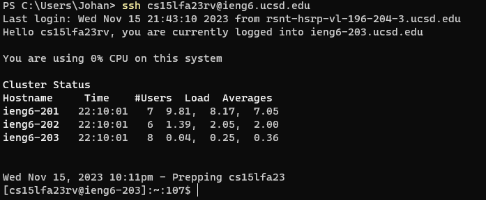
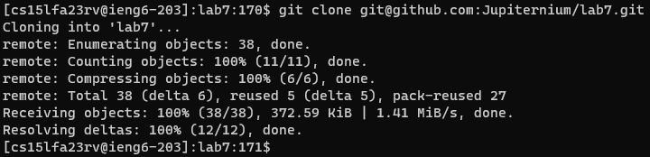
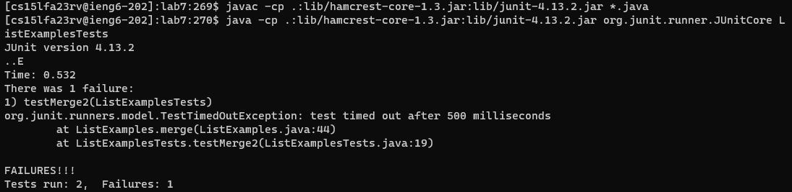
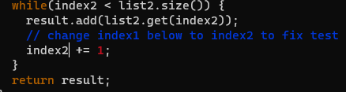
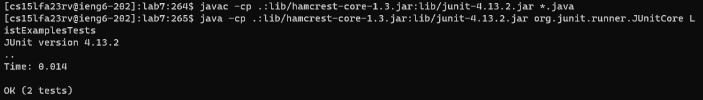
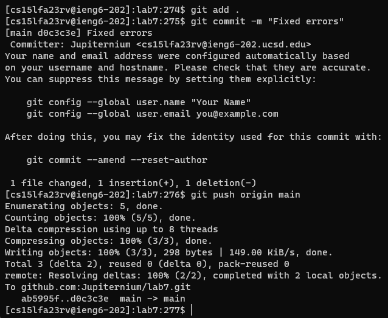

## Lab Report 4 - Vim (Week 7)

Step 1



Keys Pressed: ```<up><enter>``` The ```ssh cs15lfa23rv@ieng6.ucsd.edu``` command was 1 up in the search history, so I used the up arrow to access it

Step 2



Keys pressed: ```<up><up><enter>``` The ```git clone git@github.com:Jupiternium/lab7u.git``` was 2 up in the search history, so I used the up arrow to access it

Step 3



Keys pressed: ```<up><up><up><enter>``` The ```javac -cp .:lib/hamcrest-core-1.3.jar:lib/junit-4.13.2.jar *.java``` was 3 up in the search history, so I used the up arrow to access it. ```<down><down><enter>``` The ```java -cp .:lib/hamcrest-core-1.3.jar:lib/junit-4.13.2.jar org.junit.runner.JUnitCore ListExamplesTests``` command was the second to last command in the search history, so I used the down arrow to access it

Step 4



Keys pressed: I typed in ```vim ListExamples.java``` then did the following sequence: 

```<:44>```, ```<e>```, ```<r2>``` and ```<:wq>``` in order to go to line 44, then to the end of the word index1, then replace the current character, 1, with the character 2 and lastly save then exit the file

Step 5



Keys pressed: ```<down><down><enter>``` The ```javac -cp .:lib/hamcrest-core-1.3.jar:lib/junit-4.13.2.jar *.java``` was the second to last command I used, so I used the down arrow to access it. Then ```<up><up><up><enter>``` since the ```java -cp .:lib/hamcrest-core-1.3.jar:lib/junit-4.13.2.jar org.junit.runner.JUnitCore ListExamplesTests``` was now 3 up in the search history, so I used the up arrow to access it.

Step 6



Keys pressed: I typed in ```git add .```, then ```git commit -m "Fixed ListExamples.java"``` and then ```git push``` in order to push the changes to my repository.
