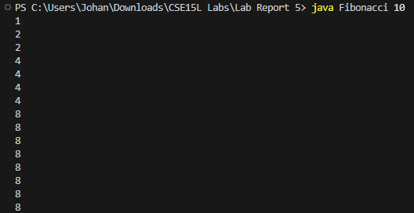
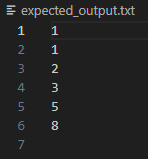
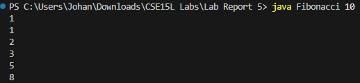

# Lab Report 5 - Putting it All Together (Week 9)

## Original Post

Hello, I have a Fibonacci program in Java that is supposed to print the Fibonacci sequence up to a given number. I also have a bash script that generates an expected_output.txt file for a given number. However, 
when I run my Fibonacci.java program, instead of printing the actual sequence, it is printing each Fibonacci number as many times as its actual value instead of just once.
I think the bug is in the way I am using a loop to print the Fibonacci sequence. I am using a while loop that checks if the current Fibonacci number is less than or equal to the argument, and then prints it and updates the previous and current Fibonacci numbers. However, I think I am updating the previous and current Fibonacci numbers in the wrong order, and I am also not using a break statement to exit the loop when the current Fibonacci number becomes greater than the argument.
Here is a screenshot of the output I get, versus the expected_output.txt file generated from test.sh: 





## TA Response

Hello, you are on the right track in your assumption of what the issue is. Try changing the order of updating the rpevious and current Fibonacci numbers, so that the current number is updated first, then the previous number is updated to the old value of the current Fibonacci number. 
Also, you should add a break statement so that the loop exits when the current number becomes greater than the command line argument. You should additionally remove the loop that is causing each number to be rpitned as many times as its value so it will just be printed once.

## Student Fix

Here is the new output after the changes: 



It worked! It appears the bug of my original code was that it did not update the previous Fibonacci number correctly. It assigned the current Fibonacci number to the previous one, instead of the old value of the current one. This caused the current Fibonacci number to grow exponentially, instead of following the Fibonacci sequence.

## Setup

*1. File & Directory Structure*

.

├── Fibonacci.java

└── test.sh


*2. Fibonacci.java before fixing the bug*

```
public class Fibonacci {
    public static void main(String[] args) {
        int n = Integer.parseInt(args[0]); // get the argument as an integer
        int prev = 0; // initialize the previous Fibonacci number
        int curr = 1; // initialize the current Fibonacci number
        while (true) { // loop indefinitely
            if (curr <= n) { // check if the current Fibonacci number is less than or equal to the argument
                for (int i = 0; i < curr; i++) { // print the current Fibonacci number as many times as its value
                    System.out.println(curr);
                }
                prev = curr; // update the previous Fibonacci number to the current one
                curr = prev + curr; // update the current Fibonacci number to the sum of the previous and current ones
            }
        }
    }
}
```

*2. Test.sh before fixing the bug*

```
n=$1

# check if the number is valid
if [ -z $n ] || [ $n -lt 0 ]; then
  echo "Please enter a positive integer as an argument"
  exit 1
fi

# initialize the previous and current Fibonacci numbers
prev=0
curr=1

# create a file for the expected output
expected_output_file='expected_output.txt'
rm -f $expected_output_file

# loop until the current Fibonacci number is greater than the number
while [ $curr -le $n ]; do
  # append the current Fibonacci number and a newline character to the expected output file
  echo $curr >> $expected_output_file
  # update the previous and current Fibonacci numbers
  temp=$curr
  curr=$((prev + curr))
  prev=$temp
done
```

*3. Command line arguments to trigger the bug*

-```java Fibonacci 10```

-```bash test.sh 10```

*4. What to edit to fix the bug*

-The line ```for (int i = 0; i < curr; i++) {``` was removed.

-The line ```System.out.println(curr);``` was moved outside the for loop.

-The line ```prev = curr;``` was replaced with ```int temp = curr;```.

-The line ```curr = prev + curr;``` was moved before the line ```prev = temp;```.

-The line ```} else {``` was added after the ```if``` condition.

-The line ```break;``` was added inside the ```else``` block.
